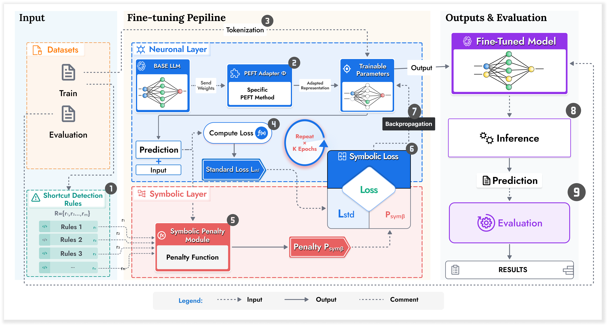

# SLMEF: Shortcut Learning Mitigation in Efficient Fine-tuning



##  Aperçu

SLMEF est un projet de recherche visant à atténuer l'apprentissage par raccourci (shortcut learning) dans les grands modèles de langage (LLMs) tout en maintenant une efficacité computationnelle optimale. Ce projet combine des techniques de fine-tuning efficace des paramètres avec des approches neuro-symboliques pour améliorer la robustesse des modèles dans des environnements à ressources limitées.

##  Fonctionnalités

- Intégration de contraintes logiques neuro-symboliques
- Techniques de fine-tuning efficace (PEFT, LoRA)
- Évaluation robuste sur des benchmarks adversariaux
- Optimisation pour matériel limité
- Métriques complètes d'évaluation

## 🛠 Installation

1. Cloner le dépôt :
```bash
git clone https://github.com/Codeur16/SLMEF-Shortcut-Learning-Mitigation-in-Efficient-Finetuning.git
cd SLMEF-Shortcut-Learning-Mitigation-in-Efficient-Finetuning
```

2. Créer et activer l'environnement virtuel :
```bash
python -m venv .venv
source .venv/bin/activate  # Sur Linux/Mac
# ou
.venv\Scripts\activate     # Sur Windows
```

3. Installer les dépendances :
```bash
pip install -r requirements.txt
```

## 🏗 Structure du Projet

```
SLMEF-Shortcut-Learning-Mitigation-in-Efficient-Finetuning/
│
├── configs/           # Fichiers de configuration
├── data/              # Données brutes
│   ├── raw/           
│   └── processed/     
│
├── notebooks/         # Notebooks d'analyse et d'expérimentation
├── outputs/           # Sorties des modèles et résultats
│   ├── models/        
│   └── predictions/   
│
├── src/               # Code source
│   ├── detection/     # Détection des biais et raccourcis
│   ├── symbolic/      # Intégration des contraintes symboliques
│   ├── finetuning/    # Implémentation des techniques de fine-tuning
│   ├── evaluation/    # Métriques et évaluations
│   └── utils/         # Utilitaires
│
└── tests/             # Tests unitaires et d'intégration
```

## 🧪 Expérimentations

### Environnement

- **Matériel** :
  - Cloud : 2× NVIDIA Tesla T4 (16GB), 2× Intel Xeon 2.2GHz, 13GB RAM
  - Local : Intel Core i5, 16GB RAM, Intel UHD Graphics

- **Stack logicielle** :
  - Python 3.8+
  - PyTorch 2.5
  - Hugging Face Transformers v4.53.3
  - PEFT et LoRA

### Jeux de données

- **Entraînement** : MultiNLI
- **Évaluation** : HANS, MNLI-hard (benchmarks adversariaux)
- **Métriques** :
  - Précision
  - Robustesse aux raccourcis
  - Temps d'entraînement
  - Nombre de paramètres entraînables

##  Lancement

1. Préparer les données :
```bash
python -m src.data_preparation.prepare_data --config configs/data_config.yaml
```

2. Lancer l'entraînement :
```bash
python -m src.train --config configs/train_config.yaml
```

3. Évaluer le modèle :
```bash
python -m src.evaluate --model_path outputs/models/best_model --test_data data/processed/test.jsonl
```

##  Visualisation des Résultats

Les résultats sont sauvegardés dans le dossier `outputs/` :
- `outputs/logs/` : Journaux d'entraînement
- `outputs/checkpoints/` : Points de contrôle des modèles
- `outputs/figures/` : Graphiques et visualisations

Pour visualiser les résultats :
```bash
tensorboard --logdir=outputs/logs/
```

##  Contribution

Les contributions sont les bienvenues ! Pour contribuer :
1. Forkez le projet
2. Créez une branche (`git checkout -b feature/AmazingFeature`)
3. Committez vos changements (`git commit -m 'Add some AmazingFeature'`)
4. Poussez vers la branche (`git push origin feature/AmazingFeature`)
5. Ouvrez une Pull Request

##  Licence

Distribué sous licence MIT. Voir `LICENSE` pour plus d'informations.

##  Contact

[Votre Nom] - [votre.email@example.com]

Lien du projet : [https://github.com/Codeur16/SLMEF-Shortcut-Learning-Mitigation-in-Efficient-Finetuning](https://github.com/Codeur16/SLMEF-Shortcut-Learning-Mitigation-in-Efficient-Finetuning)
├── models/
├── results/
└── README.md
```
## Contacts
  * charlesnjiosseu@gmail.com
  * author-2@gmail.com
